# Build Guide

## Introduction

**DISCLAIMER: Building the PER\|FORMER sequencer is not recommended for beginners!**

This build guide is intended to give experienced builders all the required information to successfully build the **PER\|FORMER** sequencer.

## Sourcing Parts

To build the sequencer you first need to source all the required parts. A complete bill of materials (BOM) can be found here:

[Google Sheet BOM](https://docs.google.com/spreadsheets/d/1ISlHD3w4I0c7bPkKgSyBY_JKwI-BUlVTNLUrIJnzrM8/edit?usp=sharing)

To make sourcing parts a bit easier, there is also a BOM at Octopart:

[Octopart BOM](https://octopart.com/bom-tool/wxkGGtzB)

The Octopart BOM contains all parts except the jacks and the encoder knob and makes it easy to order from the two main distributors [Mouser](https://www.mouser.com) and [Digikey](https://www.digikey.com).

Due to the current shortage of surface mount capacitors it can be a bit hard to source some values of capacitors. Note that most of these are used as bypass capacitors and should be easily replaceable with a different part of similar specification.

Make sure to get the LEDs specified in the BOM. The circuit for driving the matrix is operating at the current sinking limits of the shift registers. For that reason, it is important to get bright LEDs, as reducing the current limiting resistor to increase brightness will damage the shift registers!

A good source for the remaining parts is [Thonk](https://www.thonk.co.uk) in the UK:

- [PJS008U-3000-0](https://www.thonk.co.uk/shop/radio-music-sd-card-holder-only/) (also available at [Mouser](https://www.mouser.com) for builders outside of Europe)
- [PJ301BM and PJ301CM](https://www.thonk.co.uk/shop/3-5mm-jacks/)
- [Encoder Knobs](https://www.thonk.co.uk/shop/sifam-soft-touch-encoder-knobs/)

## Assembly

To help populating the PCB, its always handy to have access to the schematic and board layout. If you don't have [KiCad](http://kicad-pcb.org) installed to open the board files, you can also access the all relevant files online:

- [Interactive BOM](ibom.html)
- [Schematics (PDF)](https://cdn.rawgit.com/westlicht/performer-hardware/master/sequencer.pdf)
- [Front Silkscreen (PDF)](https://cdn.rawgit.com/westlicht/performer-hardware/master/silkscreen-front.pdf)
- [Back Silkscreen (PDF)](https://cdn.rawgit.com/westlicht/performer-hardware/master/silkscreen-back.pdf)
- [Front Silkscreen (Viewer)](https://eyrie.io/board/eca2465c9eca4299a8386ca4887076fa?pours=true&active=layout&layers=m000000000a010000000000000000000000000000000000000000000000000000000000000006&x=162560&y=54367&w=202964&h=117513&flipped=false)
- [Back Silkscreen (Viewer)](https://eyrie.io/board/eca2465c9eca4299a8386ca4887076fa?pours=true&active=layout&layers=m0000000005010000000000000000000000000000000000000000000000000000000000000006&x=162560&y=54367&w=202964&h=117513&flipped=true)

> Note: The online board viewer can also show all the other layers of the board which is handy to find where traces go and where to measure the different power rails.

### Power Section

It is best to populate the power section first. Check the _Power_ sheet in the schematics to find the required components.

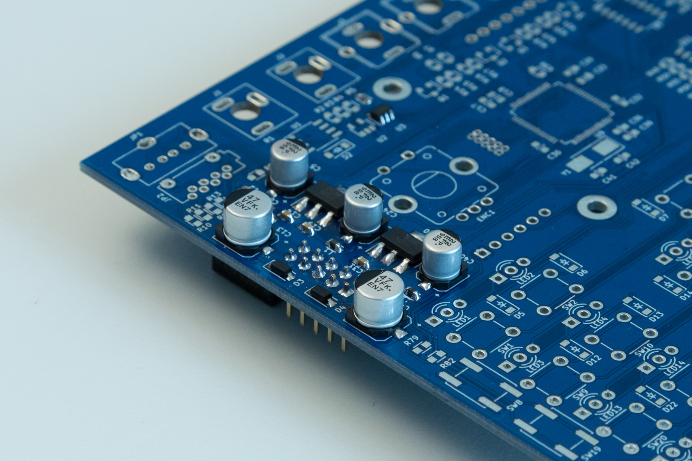

With the power section in place, it is a good idea to make sure there are no shorts between the **GND**, **+12V** and **-12V** pins on the power connector. With that confirmed, you can connect the board to a power supply to measure all the power rails for proper voltages. These can be measured on any pad on the following nets: **+12V**, **-12V**, **+5V**, **+3V3**, **+3.3VA** and **AREF_-10V**. Use the online board viewer to highlight the nets.

### MCU Section

Populate the STM32 and the components around it found on the _MCU_ sheet in the schematics. This allows for testing the JTAG connection to the STM32 and allow flashing the firmware.

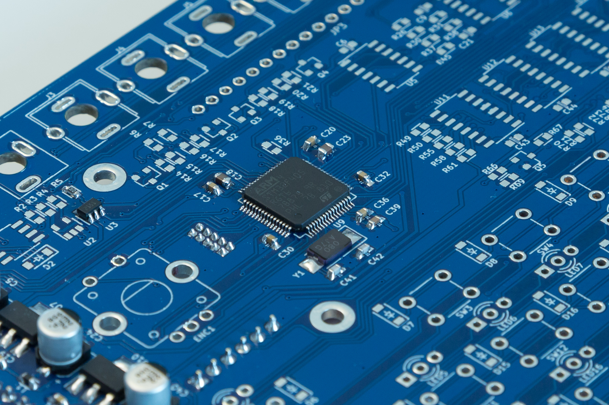

### Other Sections

Populate all other components, except for the jacks, USB connector, SD card holder, encoder and LEDs, as they will need proper alignment with the frontpanel.

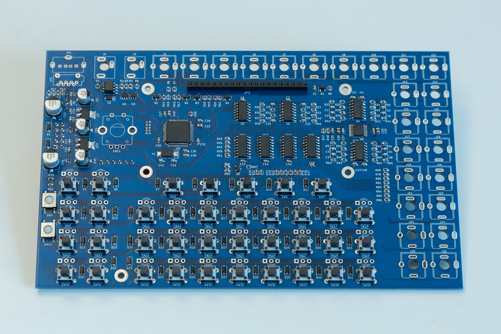

### Connectors

Populate three of the PJ301BM jacks, put on the frontpanel and tighten the nuts on the jacks. Make sure all three jacks are firmly in place and solder them down.

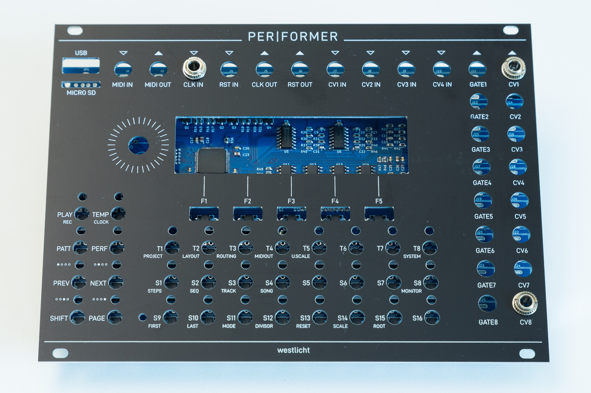

After that, remove the frontpanel, populate the remaining PJ301BM jacks, the two PJ301CM jacks, the USB connector, the SD card holder and the encoder. Put the frontpanel back on and tighten the nuts on the three previously soldered jacks. This lets you solder in the remaining jacks, making sure they are flush with the PCB. Note that the two PJ301CM jacks are actually lifted off the board a tiny bit. These two are best tightened with nuts before soldering to get the best alignment. It may be a good idea to plug in a USB cable to ensure alignment of the USB connector. Also make sure that the encoder is flush on the PCB and perfectly perpendicular.

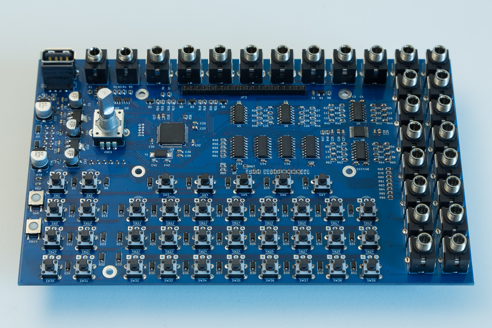

### OLED Display

Prepare the display by soldering a row of pin headers. Shorten the pins to around 3 millimeter and file of the rough edges so it can still be inserted into the socket.

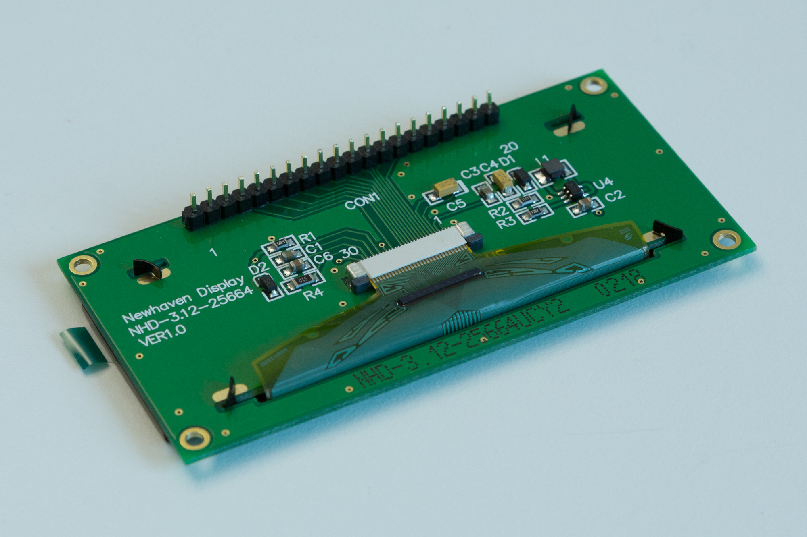

 Remove the frontpanel and use 6mm spacers and screws to attach the display to the main PCB.

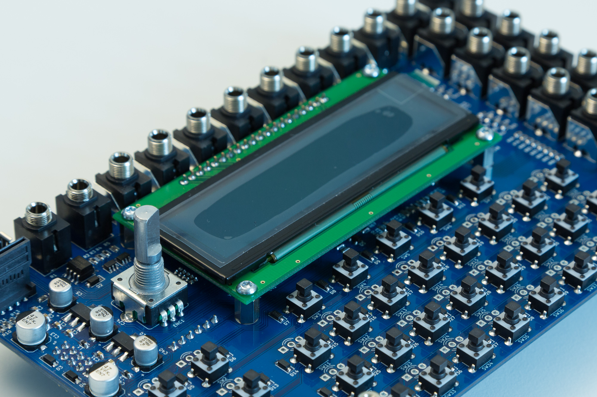

### LEDs

Next, proceed with populating all the LEDs. Note that the shortest leg goes into the rectangular pad. With all LEDs in place, put the frontpanel back on and tighten the same three jacks and the 11mm spacer. Use tape to keep all the LEDs flush to the frontpanel or use some tool to allow them come through the frontpanel just a little bit, whatever your taste is. Solder the middle leg of all LEDs and check alignment before soldering the remaining two legs of all the LEDs.

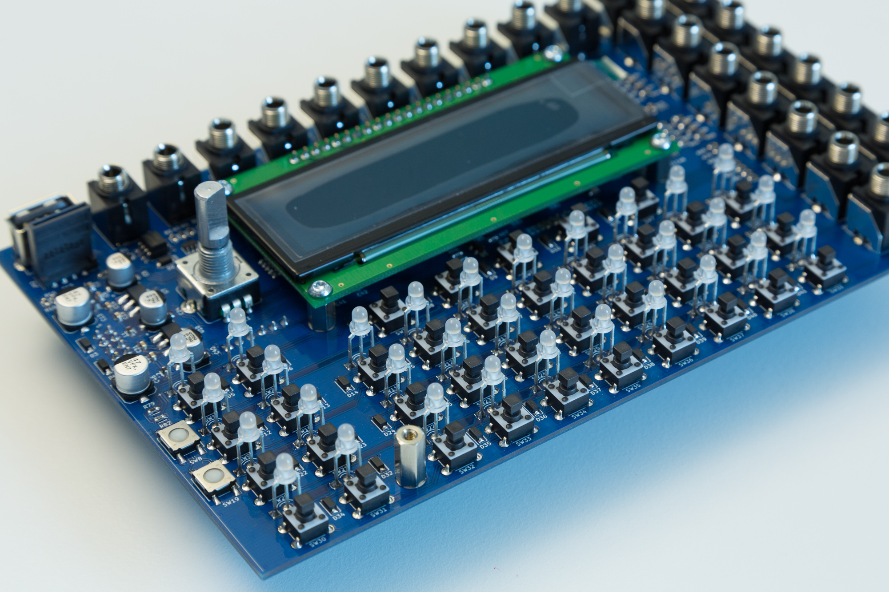

### Switch Caps

Remove the frontpanel and put the 5 rectangular switch caps on. These unfortunately cannot be put in from above the frontpanel. Put the frontpanel back on and install washers and nuts on all the jacks.

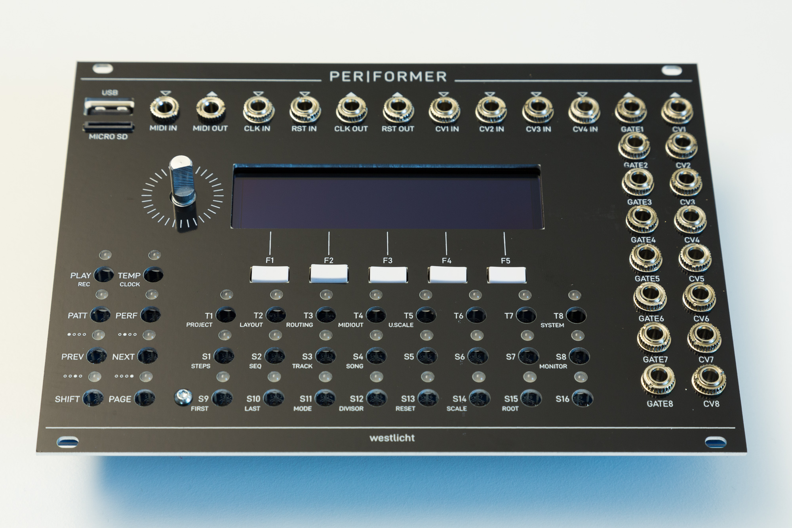

Finally, put a round switch cap to all of the remaining switches. Note that they need to pressed quite firmly to put into the right spot. You can also put on the knob on the encoder now.

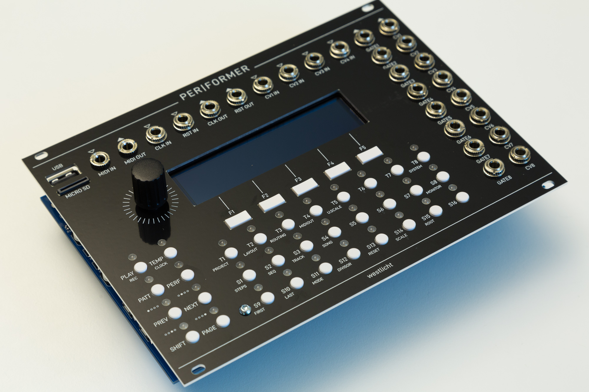

## Flashing Firmware

Flashing the firmware can be done in multiple ways. The easiest way is to download the latest firmware from the [Github Releases](https://github.com/westlicht/performer/releases) page and use the flasher of your choice. Both **bootloader.hex** and **sequencer.hex** need to be downloaded and flashed to run the sequencer. There is also **tester.hex**, a hardware test application that can be used to fully test all hardware components.

With the firmware loaded, you now hopefully have a fully working **PER\|FORMER** sequencer.

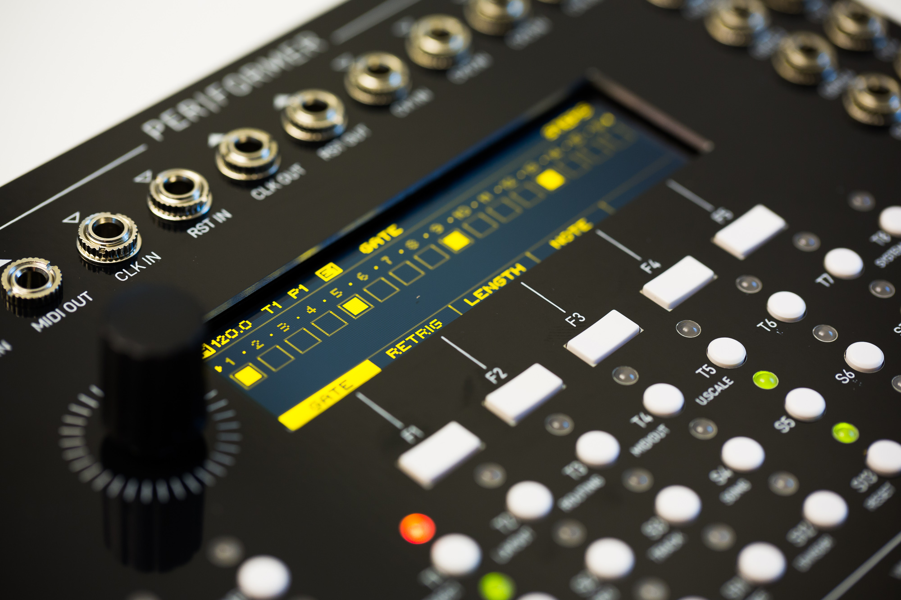
